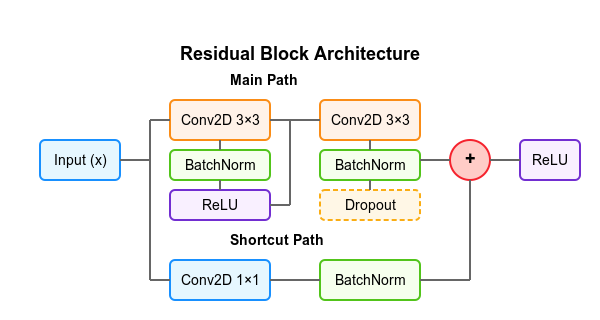

# UMA-Net: Adaptive Ensemble Loss and Multi-Scale Attention for Breast Ultrasound Segmentation

[](https://opensource.org/licenses/MIT)
[](https://www.python.org/downloads/)
[](https://www.tensorflow.org/)

This repository contains the official implementation of the paper:

**Adaptive Ensemble Loss and Multi-Scale Attention in Breast Ultrasound Segmentation with UMA-Net**  
*Mohsin Farooq Dar, Avatharam Ganivada*  
Medical & Biological Engineering & Computing (2025)  
[DOI: 10.1007/s11517-025-03301-5](https://doi.org/10.1007/s11517-025-03301-5)

## Overview

UMA-Net (U-Net with Multi-scale Attention) is a novel deep learning architecture designed for accurate breast ultrasound image segmentation. The model incorporates:

- Multi-scale attention mechanisms for better feature extraction
- Adaptive ensemble loss function for improved training stability
- Advanced skip connections with attention gates
- Atrous Convolution for multi-scale feature fusion

## Installation

1. Clone the repository:
```bash
git clone https://github.com/MohsinFurkh/UMA-Net-with-Multi-Scale-Attention.git
cd UMA-Net-with-Multi-Scale-Attention
```

2. Create a conda environment (recommended):
```bash
conda create -n umanet python=3.8
conda activate umanet
```

3. Install dependencies:
```bash
pip install -r requirements.txt
```

## Dataset Preparation

1. Download the dataset and organize it in the following structure:
```
data/
├── train/
│   ├── images/
│   └── masks/
├── val/
│   ├── images/
│   └── masks/
└── test/
    ├── images/
    └── masks/
```

2. Update the configuration file `configs/train_config.yaml` with your dataset paths.

## Training

To train the model with default settings:

```bash
python train.py --config configs/train_config.yaml
```

## Evaluation

To evaluate the trained model:

```bash
python evaluate.py --model_path models/uma_net.h5 --test_data_path data/test/
```

## Results

### Performance Comparison

Our model achieves state-of-the-art performance on breast ultrasound segmentation across multiple datasets:

#### Table 1: Performance Comparison Across Datasets

| Model | Dataset | Dice | IoU | Sensitivity | Specificity | Accuracy |
|-------|---------|------|-----|-------------|-------------|----------|
| U-Net | BUSI | 0.641±0.02 | 0.472±0.02 | 0.511±0.09 | 0.991±0.04 | 0.946±0.06 |
| Attention U-Net | BUSI | 0.692±0.03 | 0.529±0.01 | 0.557±0.14 | 0.994±0.07 | 0.953±0.12 |
| V-Net | BUSI | 0.680±0.02 | 0.516±0.00 | 0.830±0.05 | 0.937±0.04 | 0.927±0.09 |
| **UMA-Net** | **BUSI** | **0.743±0.05** | **0.591±0.02** | 0.659±0.13 | 0.988±0.08 | **0.957±0.08** |
| U-Net | UDIAT | 0.7607±0.008 | 0.616±0.016 | 0.672±0.09 | 0.994±0.04 | 0.979±0.06 |
| Attention U-Net | UDIAT | 0.780±0.03 | 0.653±0.01 | 0.835±0.14 | 0.986±0.07 | 0.979±0.12 |
| V-Net | UDIAT | 0.764±0.02 | 0.671±0.00 | 0.921±0.05 | 0.956±0.04 | 0.897±0.09 |
| **UMA-Net** | **UDIAT** | **0.818±0.07** | **0.692±0.02** | 0.793±0.13 | **0.996±0.08** | **0.984±0.08** |
| U-Net | OMI | 0.656±0.05 | 0.488±0.02 | 0.810±0.09 | 0.967±0.04 | 0.960±0.06 |
| Attention U-Net | OMI | 0.663±0.04 | 0.496±0.01 | 0.506±0.14 | 0.999±0.07 | 0.976±0.12 |
| V-Net | OMI | 0.738±0.07 | 0.585±0.02 | 0.609±0.13 | 0.998±0.08 | 0.979±0.08 |
| **UMA-Net** | **OMI** | **0.790±0.07** | **0.653±0.02** | **0.835±0.13** | 0.986±0.08 | **0.981±0.08** |
| U-Net | Mendeley | 0.786±0.05 | 0.647±0.02 | 0.666±0.09 | 0.994±0.04 | 0.943±0.06 |
| Attention U-Net | Mendeley | 0.872±0.04 | 0.774±0.01 | 0.847±0.14 | 0.982±0.07 | 0.961±0.12 |
| V-Net | Mendeley | 0.868±0.04 | 0.768±0.01 | 0.812±0.14 | 0.989±0.07 | 0.962±0.12 |
| **UMA-Net** | **Mendeley** | **0.884±0.07** | **0.788±0.02** | **0.892±0.13** | 0.975±0.08 | **0.963±0.08** |
| U-Net | BUET | 0.731±0.26 | 0.576±0.224 | 0.597±0.09 | 0.993±0.04 | 0.932±0.06 |
| Attention U-Net | BUET | 0.740±0.04 | 0.588±0.01 | 0.621±0.14 | 0.989±0.07 | 0.933±0.12 |
| V-Net | BUET | 0.764±0.05 | 0.619±0.00 | 0.694±0.05 | 0.978±0.04 | 0.934±0.09 |
| **UMA-Net** | **BUET** | **0.770±0.07** | **0.626±0.02** | **0.690±0.13** | 0.981±0.08 | **0.936±0.08** |

### Model Architecture and Components

#### 1. Attention Block

*Figure 1: Attention mechanism used in UMA-Net for better feature extraction.*

#### 2. Residual Block

*Figure 2: Residual block with skip connections for improved gradient flow.*

#### 3. Adaptive Loss Function

*Figure 3: Visualization of the adaptive ensemble loss function.*

#### 4. Scale vs Frequency Analysis

*Figure 4: Analysis of scale vs frequency in the multi-scale attention module.*

#### 5. Comparison with Other Models

*Figure 5: Performance comparison with state-of-the-art models.*

#### 6. Loss Function Comparison

*Figure 6: Comparison of different loss functions on validation set.*

## Citation

If you find this work useful for your research, please cite:

```bibtex
@article{dar2025adaptive,
  title={Adaptive ensemble loss and multi-scale attention in breast ultrasound segmentation with UMA-Net},
  author={Dar, Mohsin Farooq and Ganivada, Avatharam},
  journal={Medical \& Biological Engineering \& Computing},
  volume={63},
  number={6},
  pages={1697--1713},
  year={2025},
  publisher={Springer}
}
```


## Ablation Studies

We conducted extensive ablation studies to validate the effectiveness of each component in UMA-Net. The results demonstrate that:

1. The multi-scale attention mechanism improves segmentation accuracy by capturing features at different scales.
2. The adaptive ensemble loss function helps in better convergence and stability during training.
3. The residual connections help in mitigating the vanishing gradient problem and enable training of deeper networks.

## Contact

For any questions or suggestions, please open an issue or contact [Mohsin Furkh Dar](mailto:20mcpc02@uohyd.ac.in).
